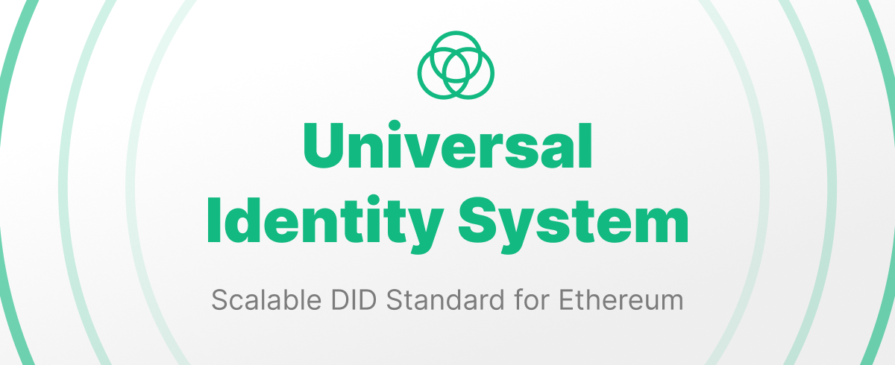

# Universal Identity System

The Universal Identity System is a scalable DID standard for the future of Ethereum: 

- Free Setup: no gas fees to create or update
- Scalable Design: minimal onchain data storage
- Verifiable Signatures: EIP-3668 for offchain data lookups

The UIS DID standard supports all EVM account types: EOA, Contract, and Smart Wallets.

## Why UIS?

Ethereum is the backbone of the decentralized web--it is time for a DID standard that is designed for the future of Ethereum.

Drawing upon years of experience, research and experimentation, UIS is a scalable DID standard that is designed to be gas efficient, scalable, and secure.

## Getting Started

The UIS smart contracts utilize [EIP-3668](https://eips.ethereum.org/EIPS/eip-3668) for offchain data lookups.

Start Backend:

```sh
pnpm ts-node ./server/app.ts
```

Run Tests:
```sh
forge test --via-ir -vvv
```

## Usage

This is a list of the most frequently needed commands.

### Build

Build the contracts:

```sh
$ forge build
```

### Clean

Delete the build artifacts and cache directories:

```sh
$ forge clean
```

### Compile

Compile the contracts:

```sh
$ forge build
```

### Coverage

Get a test coverage report:

```sh
$ forge coverage
```

### Format

Format the contracts:

```sh
$ forge fmt
```

## License

This project is licensed under MIT.
